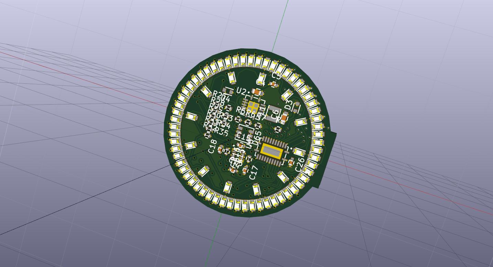

# LED Wristwatch

By Kevin Cuzner

## NOTE: This is a work in progress and may never be finished ##

Currently on github to get internet assistance with kicad crashes and other
things. I often start projects with the intention of learning something, rather
than finishing them. But, this one is pretty awesome I think and I could see
myself maybe finishing it.

## Design Features

- 32mm PCB diameter utilizing 72 0603 LEDs as the primary time display
    - Target is 3 square inches, 4 layer, with standard technology (6mil trace,
      no via in pad, etc)
- 100mAH battery from [PowerStream](http://www.powerstream.com/)
- Very high efficiency buck regulator.
    - Target battery life: >168 hours
- USB charging and programming
- STM32L0-series microcontroller
- Side-actuated mid-board PCB mount buttons with an option for replacement with
  capacitive sensors.

## Current status

- Part selection complete, except resistors
- PCB most of the way through initial 4-layer design
- Firmware not developed

This is based on a previous 44mm design that used 0805 LEDs and had touchpanel
capability. The idea with this totally new fork is to:

- Rebuild the schematic in the new version of kicad since the conversion caused
  issues. I also have some new BOM tools for kicad that are useful.
    - I'd like to also organize it using sheets since that made things a lot
      more relaxed on my dot matrix clock.
- Use 0603 LEDs and reduce the physical size.
    - The original case required a curved area underneath for my wrist which I
      found very difficult to print nicely. I want this one to be small enough
      that the watch can be absolutely flat on the bottom while not looking
      ridiculous.
- Replace the touchscreen capability with an edge button, P16849CT-ND
    - Let's be honest, my plan to perform dry film wet etching on ITO in my
      apartment is probably more costly than its worth. Maybe another day.
    - Buttons are far easier to interrupt on. I can even depopulate the
      accelerometer (a DFN) and the watch will retain its functionality.
- Use a new regulator, TPS62736 (50mA), specifically designed for low power
  applications
    - The previous design's regulator failed my mini-validation that I did. It
      had terrible low-load characteristics (probably on account of it being way
      too big).
- Use a different version of the same LiIon charging chip which has a charge
  indicator pin.
    - The circuit will charge the battery properly. The connector also works.

