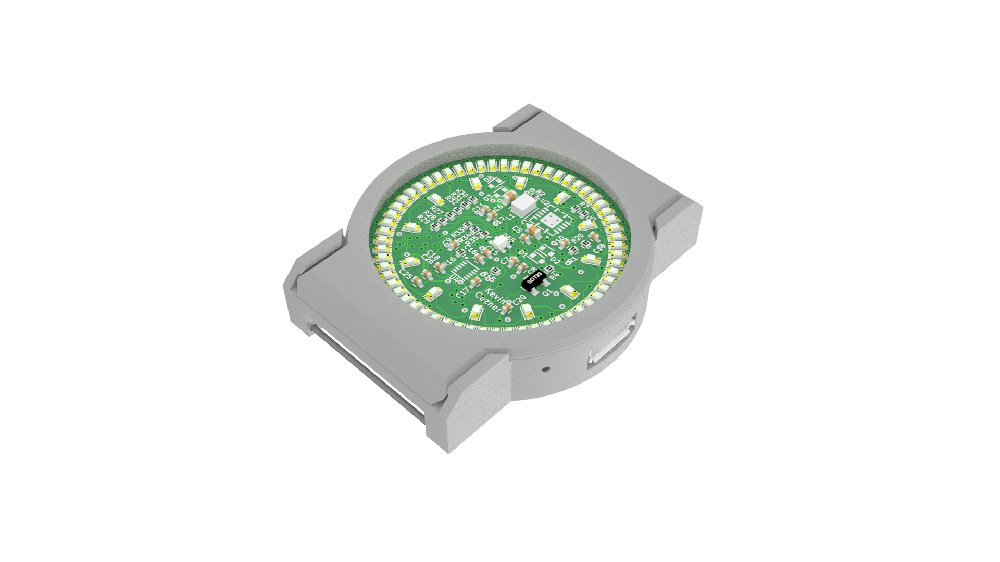
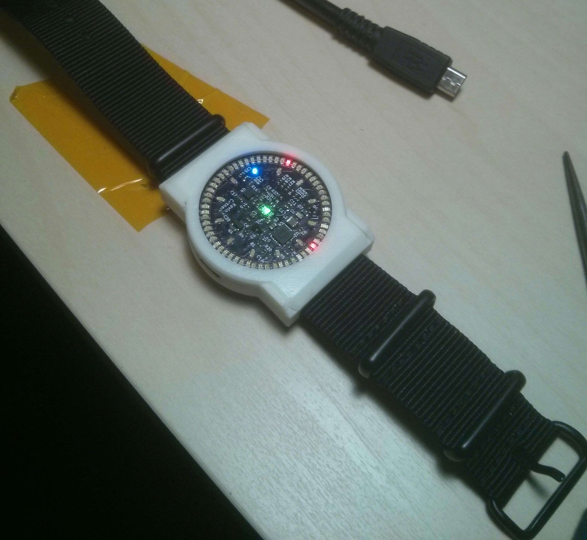

# LED Wristwatch

By Kevin Cuzner

## Design Features

- 32mm PCB diameter utilizing 72 0603 LEDs as the primary time display
    - Target is 3 square inches, 4 layer, with standard technology (6mil trace,
      no via in pad, etc)
- 100mAH battery from [PowerStream](http://www.powerstream.com/)
- Very high efficiency buck regulator.
    - Target battery life: >168 hours
- USB charging
- STM32L0-series microcontroller
- Side-actuated mid-board PCB mount buttons with an option for replacement with
  capacitive sensors.

## Key components

 - STM32L052C8 ultra-low power microcontroller
 - MMA8652 accelerometer
 - TPS65736 ultra-low quiescent current buck regulator
 - MCP73832 Li-Ion charge management controller

## Current status

This project is fairly complete, though the bootloader is still a work in
progress and may never be completed. The board was built and everything worked
after adding some reworks:

 - Trace to 3.3V from the SCL pullup was missing on the PCB. Apparently I
   deleted it while shuffling resistors around and didn't notice.
 - Central LED footprint was flipped across the X axis. The fix was to remove
   R35, short pins 1 and 4, and give up on having a blue LED in the center.
 - Leakage on Q1 through R4 (and D2, D1, and possibly U1) was enough to turn on
   the transistor. Changed R4 to 20K and bodged in a 4.7K resistor between Q1
   pins 1 and 2.

There were also two part issues which were resolved in software mostly:

 - The buttons I chose are extremely fragile. The mere act of inserting the PCB
   into the case put enough strain on them at times that 3 of the 4 buttons
   ended up breaking (they were constructed of a plastic housing with a metal
   dome held in place with what appears to be kapton tape). The buttons were
   simply not used in the software.
 - The blue LEDs I chose did not have a reverse current specification and in
   fact were not designed for reverse voltage operation. I didn't notice this
   when choosing parts, as I was rather focused on the forward voltage.
   Considering that reverse voltage is kind of key to the design here, that
   didn't work so well. Combined, the blue LEDs would draw about 28mA when the
   watch face was on or off because they actually conduct backwards. It could be
   said that they have an extremely high reverse leakage current, but I'm sure
   there's more going on there. The fix for this was to ensure that pin PA5,
   which drives the blue LEDs, was always high when the mux was disabled and all
   of its pins were driven high (effectively putting 0V across the LEDs). This
   does not reduce current consumption when the display is running (it still
   draws around 28mA), but it did reduce the sleep current to about 0.47mA.

Currently, the only method of input is either through USB or through the
accelerometer. The time is set through USB to the current time on the host PC.
The watch will automatically sleep when it is removed from USB power and will
wake when the accelerometer is tapped. When the watch is awake, the current time
is displayed. It currently stays on for about 15 seconds until shutting off
again. When USB power is reapplied the watch will reawaken. The future plans are
to also enable USB programmability of the watch, though this may never be
completed depending on my schedule and level of interest. The buttons may never
be used because they are so easy to break, but the idea was to have it behave
like a real digital watch with a timer and everything. All it does with the
buttons right now is beep when they are pressed.

As this is my first complete hardware design that I am releasing like this, I do
reserve the right to take it down at any time. I'm releasing it in the hopes
that someone finds it useful, though it clearly has its own problems and
shouldn't be considered as a reference design.

